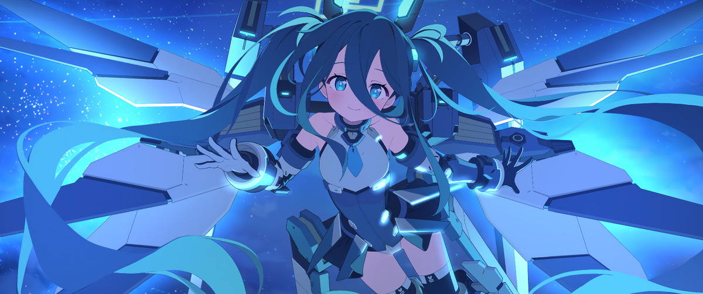
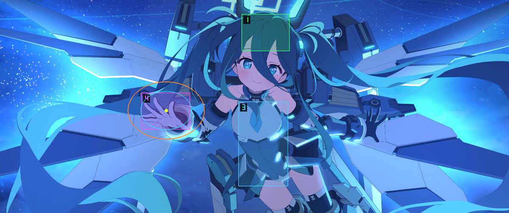
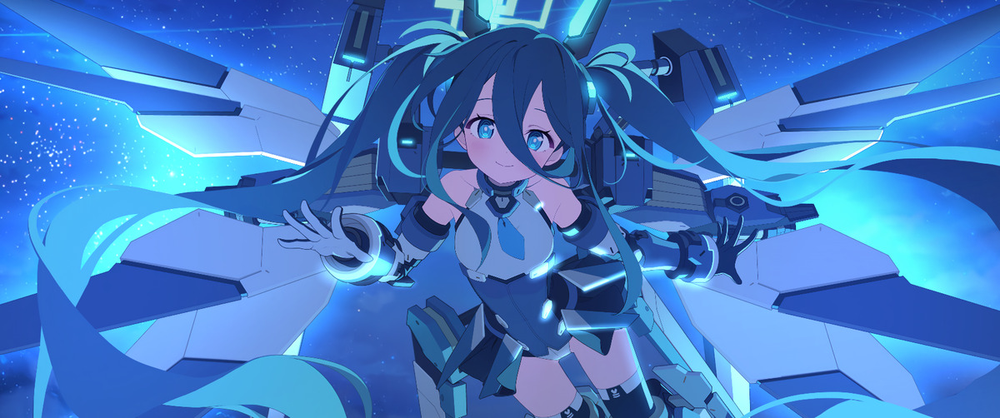

# linux-wallpaper-fork v1

An interactive Spine wallpaper host for `wlr-layer-shell` compositors. No CEF,
no browser: it reads the wallpaper's `.skel`/`.atlas` and draws them directly.

**This is not a fork of anything.** It shares no code with
`linux-wallpaperengine` (GPL-3.0) and is unaffiliated with Wallpaper Engine —
it is an independent implementation that reads the same on-disk layout.
It ships no wallpaper content, and no Spine Runtimes. Read
[NOTICE.md](NOTICE.md) before building or redistributing.

## Why

Browser-hosted wallpapers pay for a full-frame BGRA copy from CPU to GPU on
every paint. On a 3440×1440@100Hz panel that settles around ~50 `fps(screen)`.
This host draws Spine 4.2 straight through OpenGL on a layer-shell background
surface.

Measured here: **~100 present fps**, ~10–12% CPU, ~280MB RSS, full panel res.

It also plays voice lines and BGM, which browser-free mobile ports generally
do not.


## Screenshots

Rendered offscreen with `--shot` (no desktop involved). The item shown is a
Workshop wallpaper the author owns; its artwork belongs to its creator and
is reproduced here only to illustrate the host.

| idle | `--hitbox-debug` | pat gesture (`LWF_SHOT_SCRIPT`) |
|---|---|---|
|  |  |  |

## Requirements

- A `wlr-layer-shell` compositor (Hyprland, Sway, river, …)
- OpenGL 3.3, GLEW, Wayland client libraries, `pkg-config`, CMake ≥ 3.16
- `pw-play` (PipeWire) for audio
- **Your own Spine Editor license.** The Spine Runtimes are proprietary and are
  not included here; integrating them requires a license held at integration
  time. See [NOTICE.md](NOTICE.md).
- A wallpaper you already own. This project does not obtain, bundle, or
  distribute wallpapers.

## Build

```bash
git clone <this repo> linux-wallpaper-fork && cd linux-wallpaper-fork
./scripts/fetch-third-party.sh     # clones the Spine Runtimes, applies patches
cmake -S . -B build -DCMAKE_BUILD_TYPE=Release -DSPINE_SET_COMPILER_FLAGS=OFF
cmake --build build -j"$(nproc)"
```

`fetch-third-party.sh` pins the upstream commit and applies
`third_party/spine-gl-patches/*.patch` to the `spine-glfw` sample this host
builds on. If the patches stop applying, the pin moved.

## Run

```bash
./scripts/start-wallpaper.sh DP-1
# or
./build/linux-wallpaper-fork --output DP-1
```

Extra host flags pass through after the output name:

```bash
./scripts/start-wallpaper.sh DP-1 --hitbox-debug
./scripts/start-wallpaper.sh DP-1 --voice-volume 0.5
```

`--output` resolves the compositor's `wl_output.name` (`DP-1`, `HDMI-A-1`,
etc.), so one host can run independently on each connected display.

Fallback to patched LWE:

```bash
WALLPAPER_MODE=lwe ./scripts/start-wallpaper.sh DP-1
```

## Steam integration

There is no Steam integration in the API sense: this host never links
`steam_api`, never starts Steam, and never talks to the Workshop. It reads the
directory Steam has already written, so it works with Steam closed and with the
network down.

### Where items live

```
~/.steam/steam/steamapps/workshop/content/431960/<workshop id>/
├── project.json          # title, type, and the property defaults (scale, bgmfile)
├── js/main.js            # the item's own HITBOX / CHARACTER / AUDIO_DETAIL
└── assets/
    ├── 4k/<name>.skel    # + .atlas + .png  (2k/4k/8k are common)
    └── audio/*.ogg       # voicelines and BGM
```

`431960` is Wallpaper Engine's appid. Some installs put the tree under
`~/.local/share/Steam/...` or on a second library drive instead; pass
`--workshop DIR` to the scripts and `--assets DIR` to the host if yours differs.

### Which items this host can run

**Spine items only.** Wallpaper Engine's `type` field is `video`, `scene` or
`web`, and only a subset of the `web` ones are Spine-rigged. The test this
project uses is on-disk, not by name: a `.skel` with a matching `.atlas` under
`assets/`, plus a `js/main.js` to read the per-item numbers out of.

```bash
python3 scripts/list-spine-items.py          # what is installed and runnable
python3 scripts/list-spine-items.py --all    # everything, with a reason per skip
```

`video`, `scene` and non-Spine `web` items are out of scope here — a video
wallpaper needs a decoder and a scene needs Wallpaper Engine's own scene
graph. For those, use upstream
[linux-wallpaperengine](https://github.com/Almamu/linux-wallpaperengine)
(GPL-3.0); `WALLPAPER_MODE=lwe scripts/start-wallpaper.sh` hands over to it.

### From a subscribed item to a running wallpaper

```bash
python3 scripts/list-spine-items.py                # 1. find the id
python3 scripts/make-profile.py                    # 2. profile every Spine item
LWF_WALLPAPER=<workshop id> scripts/start-wallpaper.sh DP-1   # 3. run it
```

Step 2 writes `~/.config/linux-wallpaper-fork/profiles/<id>.conf` by reading the
item's own `js/main.js` and probing its `.skel`; see
[docs/PROFILE_FORMAT.md](docs/PROFILE_FORMAT.md). Step 3 is equivalent to

```bash
./build/linux-wallpaper-fork --output DP-1 \
  --assets ~/.steam/steam/steamapps/workshop/content/431960/<id>/assets/4k
```

To check an item without touching the desktop, take an offscreen shot instead:

```bash
./build/linux-wallpaper-fork --shot /tmp/x.ppm --size 960x540 --shot-time 2.0 \
  --assets .../<id>/assets/4k
```

`scripts/verify-generic.sh` does exactly that for every profiled item at once.

### What this project will not do

Items are yours, not ours. This repository ships no skeleton, atlas, texture,
audio clip or profile for any item, and the tooling only ever reads items that
are already installed under your own Steam account. Do not run it against
content you do not own, and do not redistribute an item — or a profile
generated from one — with this host. See [NOTICE.md](NOTICE.md).

## Other wallpapers (profiles)

The host is generic; everything per-character (hitboxes, animation names, bone
names, voiceline timings, BGM file, design space, scale) lives in a profile.

```bash
python3 scripts/make-profile.py            # all Spine items in the workshop dir
python3 scripts/make-profile.py --stdout <workshop id>
LWF_WALLPAPER=<workshop id> scripts/start-wallpaper.sh DP-1
```

`make-profile.py` reads each item's own `js/main.js` — `HITBOX`, `CHARACTER`,
`AUDIO_DETAIL`, `bgmfile` — and probes the `.skel` for the animation names, so a
character that has never been run gets a profile without anything transcribed by
hand. Output: `~/.config/linux-wallpaper-fork/profiles/<workshop id>.conf`, which the
host finds from the `--assets` path (`--profile FILE` overrides, and
`<item>/wallpaper-profile.conf` is checked first for a hand-tuned one).

`<id>.local.conf` next to it is an **overlay**: it merges on top of the generated
profile, so hand-tuned zones survive re-running the generator. This is where
corrections to an item's own numbers belong — several items declare a pinch
rect whose top edge sits on the eyebrow line, so aiming at the lower head lands
in the cheek zone; nudging it down to the cheek itself fixes that without
touching the item.

A profile is authoritative, not a patch on some other item's values: a key that
is absent is *off*. Items that have no `pinch` rect and no `Pinch_*` animations
end up with a cheek that is simply not clickable, rather than firing an
animation they have no keys for. **With no profile at all, nothing is
clickable** — the built-in defaults are empty on purpose, so the host never
applies one item's hit zones to another.

Format is `key=value`, `#` comments, repeated `voice.line=TOTAL START1 START2`
per line (in order). Run with `LWF_TRACE_INPUT=1` to see which profile loaded.

## Interaction

The gesture model mirrors what a web-hosted item does in its own `js/main.js`
(`HITBOX` + `t()` + `pressedMouse`/`movedMouse`/`releasedMouse`); the numbers
come from the item, not from this repo. All of it is driven by the real
pointer. `--auto-idle` is the only thing that moves a character without input,
and it is off by default.

| Zone (rects below are one item's; every item differs, and they come from its profile) | Design rect (2560×1600, y down) | Gesture |
|---|---|---|
| headpat | x 1400–1900, y 0–450 | press over the head, then **drag** — the cursor's position in the zone drives `Touch_Point` (±30), eased; `PatEnd_01_M` runs 0.25s after the last release, so repeated strokes stay one gesture |
| pinch | x 1420–1800, y 500–830 | **hold** on the cheek to keep the pinch; release runs the `PinchEnd` pair |
| voiceline | x 600–1320, y 870–1400 | press on the chest, release to play `Talk_0N_M`/`_A` (N cycles 1→5); dragging out cancels |
| anywhere else | — | eye tracking (`Look_01_M`, steps toward the cursor and clamps) |

`t()` collapses to `L/2 + transpose·(px − mid) / scale`, so **`transpose` must be
derived in `resize()`** (`2560/width` or `1600/height`, whichever axis fits).
Without it the zones land in the wrong place — the old approximation put the
headpat box over the cheek and had no pinch or voiceline zone at all.

Zones are clamped by the panel aspect: at 3440×1440 the headpat rect starts
above the top edge (screen y −140…344), which matches the reference.

The rects also leave dead bands between them (headpat ends at y 450, pinch starts
at 500; pinch ends at 830, voiceline starts at 870). A press there fell through to
eye tracking, so the hit test runs a second pass with a 45-unit grace margin in
the same priority order. Without it roughly one press in three lands on nothing.

`--hitbox-debug` (or `LWF_DRAW_HITBOX=1`) draws them — it works in `--shot` too,
so you can check placement without touching the desktop. `LWF_TRACE_INPUT=1`
logs every press/release with its design-space coords and whether it was ignored,
which is the fastest way to tell "the zone is wrong" from "the click never arrived".

Two gesture details that upstream gets wrong for a real pointer:

- **Pinch is a hold, not a click.** Upstream queues `PinchEnd` in the same press
  handler, so the chain always plays out and holding does nothing. Here the press
  only sets `Pinch_02_M`/`Pinch_01_M` — a finished non-looping entry keeps
  applying its last frame, so the expression stays until release. A quick click
  still looks right because `PinchEnd` is *queued* when the 0.667s intro has not
  finished and started immediately when it has.
- **Presses are not gated.** Upstream's `acceptingClick` plus its 500ms settle
  timer plus the whole-voiceline lockout (11–16s) swallowed 42% of real presses,
  measured with `LWF_TRACE_INPUT=1`. The only gate left is an 80ms debounce
  against a doubled press event; anything else replaces the running gesture, and a
  press during a voiceline cuts the line off (its forked players are killed).
- **A cut-off voiceline does not consume its index.** Upstream advances
  `currentVoiceline` from the end-of-line timer; advancing it in `playVoiceline`
  instead meant every interrupted press skipped a line, so pressing the chest
  repeatedly raced through the whole set. The index now moves only when the line
  reaches `voiceUntil`.
- **Petting follows position, eased.** Upstream's ±5-per-event stepping made the
  stroke faceted. `patTargetFor()` maps the cursor to the bone target and
  `updateInteraction` eases toward it per frame (`kHeadpatFollowRate`), including
  the release ease home — the 20ms grid is only used for the eye now.
- **A run of strokes is one pat.** Upstream ends the gesture on every release, so
  `PatEnd_01_M` opens the eyes and the next press restarts `Pat_01_M` from frame 0
  and shuts them again: at a normal stroke rate the eyes flicker open/closed
  ("it looks like she opens her eyes and blinks again"). Releases now schedule
  `PatEnd` `kPatRelease` (0.25s) ahead and a new stroke cancels it. A repeat while
  `Pat_01_M` is still current keeps the exact track time instead of rewinding it;
  this prevents a short release/press gap from visibly resetting the motion.
  Only a press that interrupts `PatEnd` starts `Pat_01_M` at `kPatLidsDown`
  (0.18s in, lids already down), rather than passing through frame 0's open eyes.
  Gesture entries also mix in over `kGestureMix` (0.06s) instead of the 0.2s
  default, which is what made the switch feel delayed. The hand still comes home
  on release — only the expression waits.
- **Persistent gaze yields to finite reactions.** Pointer motion no longer starts
  `Look_*` while `Pat`, `PatEnd`, `PinchEnd`, or `Talk` owns tracks 1/2. Before
  this guard, a one-pixel motion immediately after release erased the gesture and
  made the result depend on click timing. Gaze resumes automatically afterward.
- **A pat press clears track 2.** The pat has no `_A` layer (upstream comments
  `Pat_01_A` out), so track 2 still held `PatEnd_01_A` from the *previous* release,
  and that entry's queued empty animation faded out in the middle of the new pat —
  the eyes drifted open and shut again about 0.3s in. Only the second and later
  clicks showed it, because the first one starts from an empty track.
- **A wind-down absorbs double-click jitter.** The second click of a double-click
  lands a few pixels off, resolved to eye tracking (or, with upstream's rects, to
  the cheek), and *that* cut the pat off and snapped the eyes open mid-gesture.
  While `patEndAt` is pending, a press that hit nothing in particular within
  `kPatContinueGrace` (200) of the headpat rect continues the pat instead. Only
  zone 3 is reconsidered, so a deliberate pinch or voiceline press still wins.

### Replaying a gesture offscreen

Reasoning about which Spine calls a gesture makes is how interaction bugs survive;
replay it instead. `LWF_SHOT_SCRIPT` feeds events through the *live*
`pressedMouse`/`movedMouse`/`releasedMouse` and `updateInteraction`, and
`LWF_SHOT_SERIES` writes the whole timeline in one process (~1s for 50 frames).

```bash
LWF_SHOT_SERIES=/tmp/pat LWF_SHOT_FPS=12 \
LWF_SHOT_SCRIPT="0.2:press:590,100;0.6:move:610,120;1.7:release" \
  ./build/linux-wallpaper-fork --shot /tmp/pat/x.ppm --size 960x540 --shot-time 4.5
```

Events are `TIME:press:X,Y`, `TIME:move:X,Y`, `TIME:release`, `TIME:anim:TRACK,NAME`
(`empty` clears a track); X/Y are screen pixels **for the shot size**, so take a
`LWF_DRAW_HITBOX=1` shot first to pick them, and check the printed `mode=` is the
gesture you meant. `LWF_SHOT_ANIM=Pinch_02_M` still sets a single pose directly.

Track 0 (`Idle_01`, 13.3s) keeps running underneath, so compare two shots taken at
the same `--shot-time` or the idle drift will swamp the difference:
`magick compare -metric RMSE gesture.ppm idle.ppm null:` reads 0 when a gesture has
fully returned to idle.

Interaction timing follows upstream's 20ms `setInterval` steps (`EYE_STEP` 10,
`HEADPAT_STEP` 5), run on a fixed accumulator rather than per frame — at 100Hz
a per-frame step would move the bones 1.7× too fast.

## Offscreen shot (for judging the look)

Renders one frame to an FBO and dumps a PPM. Nothing appears on any monitor, so
you can A/B the render even when the wallpaper is covered by windows.

```bash
./build/linux-wallpaper-fork --shot /tmp/shot.ppm --size 3440x1440 --shot-time 2.0
magick /tmp/shot.ppm /tmp/shot.png
```

Debug env vars:

- `LWF_DEBUG_BLEND=1` — one-shot census of the first frame: per-command blend
  mode, texture id, vertex colors, geometry bbox. This is how you tell a camera
  bug from a blending bug.
- `LWF_FORCE_NORMAL_BLEND=1` — collapse every slot to Normal blending
  (reproduces an old regression; useful as an A/B).

## Assets

`--assets DIR` is required — there is no default, and no item ships with this
repository. `DIR` is a resolution folder inside a Workshop item you own, e.g.
`~/.steam/steam/steamapps/workshop/content/431960/<item id>/assets/4k`.
`scripts/start-wallpaper.sh` builds this path from `LWF_WALLPAPER` /
`LWF_ASSETS` for you.

## Render contract — must match `js/main.js` + spine-webgl 4.2

Every one of these was wrong at some point and each produced a distinct
misrender. Do not "simplify" them.

| Thing | Required value | Symptom when wrong |
|---|---|---|
| `Skeleton.yDown` | **false** (plain y-up ortho) | whole skeleton lands at negative y — only the sun flare clips in, rest black |
| Camera | `ortho2d(0 - w/2, 900 - h/2, w, h)`, design 2560×1600 **divided by `scale`** | framing too tight / off-centre |
| `scale` property default | **0.8** (`--scale` to override) | ~25% too zoomed in |
| `premultipliedAlpha` | **false** | washed-out or double-darkened edges |
| Shader | two-colour tint, exact `newTwoColoredTextured` formula | flat scene on tint-black slots |
| dark colour alpha | 0 when non-PMA (spine-cpp hardcodes `0xff`) | wrong semi-transparent edges |
| Blend mode | **per slot** — one measured frame here is 11 Normal + 9 Additive | forcing Normal turns the glow layers into a milky wash |
| Texture filter | whatever the `.atlas` says (here `Linear, Linear`, no mipmaps) | halo bleed on straight-alpha atlases |
| Clear colour | project.json `schemecolor` = `0 0 0`, alpha 1 | visible seams under transparent slots |
| Buffer alpha | masked off after clear (web canvas is `alpha: false`) | compositor blends the wallpaper |

Verified against the CEF render: mean RGB / contrast / saturation agree within
~5% (the residual is the framing difference of the capture).

## Notes

- Spine runtime is under Esoteric license (personal/editor license rules apply).
- Audio: voicelines play at `--voice-volume 0.5` (upstream's `volume`) by forking
  `pw-play`/`paplay` per clip at the `AUDIO_DETAIL` offsets; there is no decoder
  in-process and subtitles are not ported. BGM is off despite `project.json`
  saying `bgmvolume: 20` — enable with `--bgm-volume 0.2`. The BGM player is
  respawned when it exits (that is the loop) and killed on SIGTERM, otherwise
  `pkill linux-wallpaper-fork` would leave the music playing.
- `pgrep -x linux-wallpaper-fork` never matches: `/proc/<pid>/comm` truncates to
  15 chars (`linux-wallpaper`). Match `-f /linux-wallpaper-fork` instead.
- The GUI (`~/simple-linux-wallpaperengine-gui`) has a periodic backend restart
  and a restore-on-start, both of which used to relaunch the CEF wallpaper on top
  of this host. It now skips automatic launches while this host is alive, and
  takes it down when the user picks a different wallpaper.
- `acceptingClick` is honoured: a new press is ignored while a line plays or a
  gesture is still easing home, and `wl_pointer.leave` counts as a release so a
  window stealing the pointer mid-drag cannot latch the gesture.
- spine-cpp asserts on unknown animation names (and dereferences null with
  `NDEBUG`), so every play goes through a `findAnimation` guard. Items that
  lack the `_A` eye variants make upstream's `HAS_A.eye = false` free here.
- `eglSwapInterval(0)` + `wl_surface_frame` before swap is required to avoid the 50fps half-refresh trap.

## Credits

- Design, integration and testing: **Relrei**
- Implementation assistance: **Claude Code** (Anthropic) — the renderer, the
  Wayland/EGL surface, the interaction model and the offscreen shot tooling
  were written in pair-programming sessions with it.
- Spine Runtimes: Esoteric Software (not bundled — see NOTICE.md).
